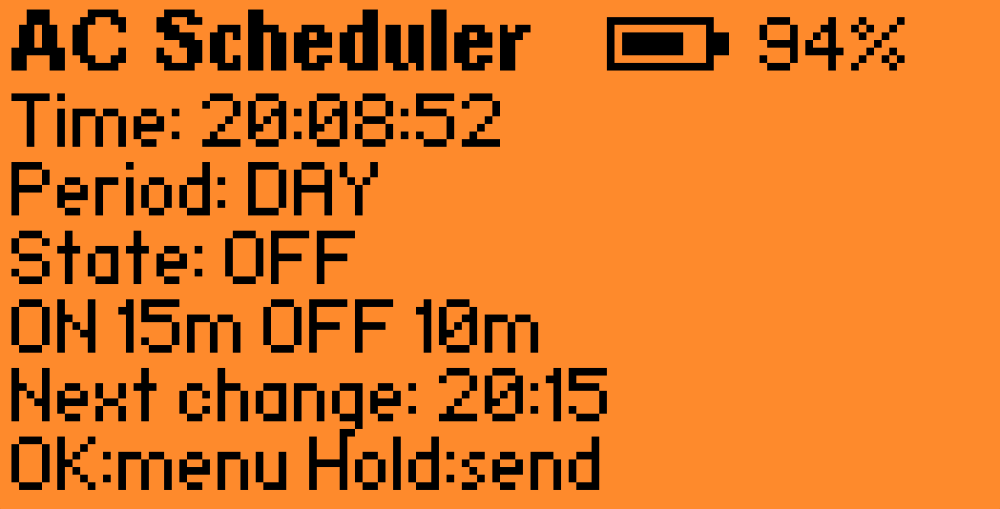

# AC Scheduler

External FAP application for Flipper Zero. It controls an air conditioner with already recorded infrared buttons and an RTC-based ON/OFF schedule.

AC remotes are often overloaded with tiny buttons, mystery modes, and long-forgotten icons. Older units can be even worse: the remote still works, but using it as a scheduler is not exactly a joy. AC Scheduler was made as a small, practical Flipper app that does one job: replay the right AC button at the right time.

Future versions may add temperature sensor integration, so the schedule can react to the room instead of only following the clock.

The app runs only while it is open on the Flipper. Exiting the app does not automatically turn the AC off.

## Features

- RTC-based autonomous ON/OFF schedule.
- Separate day and night periods.
- On-device schedule settings.
- Settings persistence on the Flipper SD card.
- Playback of existing IR buttons from a saved remote.
- Manual inverse command with a long `OK` press.
- Debug mode for direct ON/OFF transmission with hardware buttons.
- Main screen with time, period, state, next transition, and battery level.

## Screenshots

Main screen:



Schedule settings:


## Project Layout

```text
.
├── application.fam       # external FAP manifest
├── ac_config.h           # IR remote/buttons and default schedule
├── src/
│   ├── ac_scheduler.c/.h # lifecycle, GUI, input, settings storage
│   ├── ac_schedule.c/.h  # pure schedule calculation
│   └── ac_infrared.c/.h  # saved IR signal loading/transmission
├── ac_scheduler.png      # app icon
├── docs/screenshots/     # README screenshots
├── README.md
├── AGENT.md
├── CHANGELOG.md
└── LICENSE
```

Application code lives in `src/`. `ac_config.h` intentionally stays in the project root because it is the main file users normally edit for their own saved remote.

## IR Commands

The app is intentionally tied to buttons inside one saved remote.

Current `ac_config.h` values:

```c
#define AC_CONFIG_REMOTE_PATH "/ext/infrared/Remote.ir"
#define AC_CONFIG_ON_BUTTON_NAME "Ac_on_cool_23_2"
#define AC_CONFIG_OFF_BUTTON_NAME "Ac_off"
#define AC_CONFIG_DEBUG_MANUAL_MODE 0
```

The Flipper SD card must contain:

```text
/ext/infrared/Remote.ir
```

That remote must contain buttons with these exact names:

```text
Ac_on_cool_23_2
Ac_off
```

If you rename the remote or its buttons in the Infrared app, update these strings in `ac_config.h` and rebuild the FAP.

Do not add `U` to string values. Paths and button names are plain quoted C strings.

## Schedule

Default schedule values are defined in `ac_config.h`:

```c
#define AC_DEFAULT_DAY_START_HOUR 8
#define AC_DEFAULT_DAY_START_MINUTE 0
#define AC_DEFAULT_NIGHT_START_HOUR 23
#define AC_DEFAULT_NIGHT_START_MINUTE 0

#define AC_DEFAULT_DAY_CYCLE_MINUTES 15
#define AC_DEFAULT_DAY_ON_MINUTES 5

#define AC_DEFAULT_NIGHT_CYCLE_MINUTES 20
#define AC_DEFAULT_NIGHT_ON_MINUTES 5
```

Default behavior:

- day: `08:00` to `23:00`, `5m ON / 10m OFF`;
- night: `23:00` to `08:00`, `5m ON / 15m OFF`;
- cycles are aligned to the start of the active period, not to app startup time;
- the night period continues through midnight, so `00:00` is treated as 60 minutes after `23:00`.

Examples:

```text
08:00 ON
08:05 OFF
08:15 ON
08:20 OFF

23:00 ON
23:05 OFF
23:20 ON
23:25 OFF
```

## App Controls

The schedule can be changed directly inside AC Scheduler.

Main screen:

- short `OK`: open settings;
- long `OK`: send the inverse command of the current commanded state and temporarily switch state manually;
- short `Back`: exit;
- battery percentage is shown in the top-right corner next to the battery icon.

Settings screen:

- `Up` / `Down`: select row;
- `Left` / `Right`: change value;
- `OK`: save;
- `Back`: cancel changes.

Settings fields:

- `Day`: day period start time;
- `Night`: night period start time;
- `D on`: daytime ON duration;
- `D off`: daytime OFF duration;
- `N on`: nighttime ON duration;
- `N off`: nighttime OFF duration.

The `^v row <> val` hint means: up/down selects a row, left/right changes the selected value.

Saved settings are written to the Flipper SD card:

```text
/ext/apps_data/ac_scheduler/settings.bin
```

Reinstalling the `.fap` should not overwrite this file. Values from `ac_config.h` are used only on first launch or when the saved settings file is missing/outdated.

To reset the schedule to the defaults from `ac_config.h`, delete this file on the Flipper:

```text
/ext/apps_data/ac_scheduler/settings.bin
```

## Quick Test

For fast switching tests, change the schedule inside the app:

```text
D on  = 1m
D off = 1m
N on  = 1m
N off = 1m
```

This creates a `1m ON / 1m OFF` cycle.

If `ON = 1m` and `OFF = 0m`, no OFF command will be sent because the whole cycle is occupied by ON.

## Debug Manual Mode

Manual debug mode can be enabled in `ac_config.h`:

```c
#define AC_CONFIG_DEBUG_MANUAL_MODE 1
```

In this mode, the schedule does not transmit commands automatically.

Controls:

- short `Up`: send ON;
- short `Down`: send OFF;
- short or long `OK`: reload the saved remote;
- short `Back`: exit.

After testing, restore:

```c
#define AC_CONFIG_DEBUG_MANUAL_MODE 0
```

## Build

From the project root:

```sh
ufbt
```

If this project is kept as a subdirectory in the current local workspace and uses the adjacent virtual environment:

```sh
cd /Users/icefox/Repo/flipper/ac_scheduler
../.venv/bin/ufbt
```

Build output:

```text
dist/ac_scheduler.fap
```

## Deploy And Launch

Connect the Flipper over USB and run:

```sh
ufbt launch
```

Or with the local uFBT environment:

```sh
cd /Users/icefox/Repo/flipper/ac_scheduler
../.venv/bin/ufbt launch
```

`ufbt launch` builds the app, copies the FAP to the Flipper, and starts it.

If you get a `Resource busy` error, the Flipper USB port is already opened by another process. Close qFlipper, Serial Monitor, screen/minicom, or any other window that may be holding the port.

## VS Code

IntelliSense uses:

```text
.vscode/compile_commands.json
```

This file is regenerated by `ufbt`.

If include highlighting breaks:

```text
Cmd+Shift+P -> C/C++: Reset IntelliSense Database
Cmd+Shift+P -> Developer: Reload Window
```
